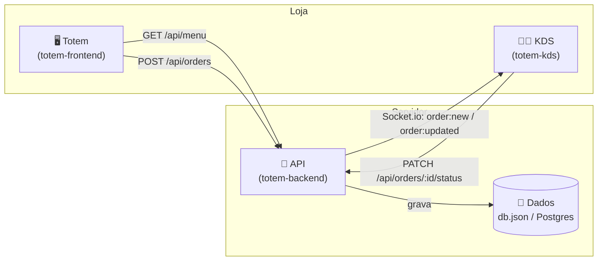
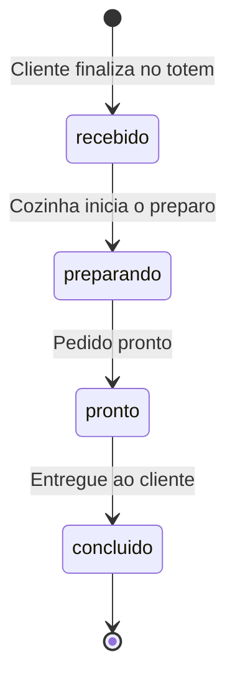

#  Totem — Sistema de Autoatendimento para Restaurantes

Sistema completo de totem de autoatendimento para hamburguerias, padarias e
restaurantes em geral: cliente monta o pedido sozinho na tela, paga, e a
cozinha recebe tudo em tempo real num painel próprio.

<!--
  Sugestão: coloque aqui um GIF ou screenshot do totem em ação.
  Exemplo de como referenciar uma imagem salva em docs/screenshots/:
  
-->


---

## 📋 Índice

- [Visão geral](#-visão-geral)
- [Arquitetura](#-arquitetura)
- [Screenshots](#-screenshots)
- [Estrutura de pastas](#-estrutura-de-pastas)
- [Pré-requisitos](#-pré-requisitos)
- [Como rodar](#-como-rodar)
- [Rodando com Docker](#-rodando-com-docker)
- [Endpoints da API](#-endpoints-da-api)
- [Fluxo de um pedido](#-fluxo-de-um-pedido)
- [Roadmap / o que falta](#-roadmap--o-que-falta)
- [Stack utilizada](#-stack-utilizada)

---

## 🎯 Visão geral

O projeto é dividido em **três aplicações independentes** que conversam
entre si:

| App | Pasta | Quem usa | Porta |
|---|---|---|---|
| 🧾 **Backend / API** | `totem-backend` | — (servidor) | `3001` |
| 🖥️ **Totem** | `totem-frontend` | Cliente, na loja | `5173` |
| 👨‍🍳 **KDS (painel da cozinha)** | `totem-kds` | Equipe de cozinha | `5174` |

O cliente monta o pedido no totem → o pedido é enviado pra API → a API
avisa o painel da cozinha **em tempo real** (via WebSocket) → a cozinha
avança o status do pedido conforme prepara.

## 🏗 Arquitetura



## 📸 Screenshots

<!--
  Substitua os placeholders abaixo por imagens reais assim que tiver.
  Crie uma pasta docs/screenshots/ no repositório e salve os prints lá.
-->

| Tela do totem | Painel da cozinha (KDS) |
|---|---|
|  |  |

| Customização do item | Pedido confirmado |
|---|---|
|  |  |

> 💡 Dica: para gravar um GIF de demonstração, use o [ScreenToGif](https://www.screentogif.com/)
> (Windows, grátis) ou o [Kap](https://getkap.co/) (Mac).

## 📁 Estrutura de pastas

```
Totem/
├── docker-compose.yml
│
├── totem-backend/            # API (Node + Express + Socket.io)
│   ├── package.json
│   ├── schema.sql             # schema Postgres de referência
│   ├── Dockerfile
│   ├── data/
│   │   └── db.json            # criado automaticamente ao rodar
│   └── src/
│       ├── index.js
│       ├── db.js
│       └── routes/
│           ├── menu.js
│           └── orders.js
│
├── totem-frontend/           # Tela do totem (React + Vite)
│   ├── package.json
│   ├── vite.config.js
│   ├── Dockerfile
│   └── src/
│       ├── main.jsx
│       └── App.jsx
│
└── totem-kds/                 # Painel da cozinha (React + Vite)
    ├── package.json
    ├── vite.config.js
    ├── Dockerfile
    └── src/
        ├── main.jsx
        └── App.jsx
```

## ✅ Pré-requisitos

- [Node.js](https://nodejs.org) 18 ou superior
- npm (já vem junto com o Node)
- (Opcional) [Docker Desktop](https://www.docker.com/products/docker-desktop/), para rodar via containers

## 🚀 Como rodar

Cada aplicação roda em um terminal separado. **Inicie sempre o backend primeiro.**

### 1. Backend (API)

```bash
cd totem-backend
npm install
npm start
```

API disponível em `http://localhost:3001`.

### 2. Totem

```bash
cd totem-frontend
npm install
npm run dev
```

Abre automaticamente em `http://localhost:5173`.

### 3. Painel da cozinha (KDS)

```bash
cd totem-kds
npm install
npm run dev
```

Abre automaticamente em `http://localhost:5174`.

## 🐳 Rodando com Docker

Alternativa ao passo a passo acima — sobe as três aplicações de uma vez:

```bash
docker-compose up --build
```

| Serviço | URL |
|---|---|
| Totem | http://localhost:5173 |
| KDS | http://localhost:5174 |
| API | http://localhost:3001 |

Para parar:

```bash
docker-compose down
```

## 🔌 Endpoints da API

| Método | Rota | Descrição |
|---|---|---|
| `GET` | `/api/health` | Verifica se a API está no ar |
| `GET` | `/api/menu` | Categorias + itens do cardápio |
| `GET` | `/api/menu/extras` | Lista de adicionais |
| `POST` | `/api/orders` | Cria um pedido novo |
| `GET` | `/api/orders?status=` | Lista pedidos (filtro opcional por status) |
| `GET` | `/api/orders/:id` | Detalhe de um pedido |
| `PATCH` | `/api/orders/:id/status` | Atualiza o status do pedido |

<details>
<summary>Exemplo: criar um pedido</summary>

```bash
curl -X POST http://localhost:3001/api/orders \
  -H "Content-Type: application/json" \
  -d '{
    "type": "aqui",
    "paymentMethod": "pix",
    "items": [
      { "menuItemId": 1, "name": "Smash Clássico", "qty": 2, "unitPrice": 24.9, "extras": ["cheese"] }
    ]
  }'
```
</details>

### Eventos em tempo real (Socket.io)

| Evento | Quando dispara |
|---|---|
| `order:new` | Um pedido novo é criado |
| `order:updated` | O status de um pedido muda |

## 🔄 Fluxo de um pedido



## O que falta ?

Este projeto é um **protótipo funcional**, não uma versão de produção. Itens
pendentes antes de usar numa loja de verdade:

- [ ] Integração de pagamento real (PIX/cartão via Stone, Cielo, PagSeguro etc.)
- [ ] Banco de dados Postgres em produção (hoje é um arquivo `db.json` local — schema já pronto em `schema.sql`)
- [ ] Autenticação no painel da cozinha
- [ ] Integração com impressora de comanda (ESC/POS)
- [ ] Modo offline (fila local de pedidos se a internet cair)
- [ ] Suporte real a múltiplas lojas
- [ ] Deploy em produção (Railway/Render para a API, Supabase/Neon para o banco)

## 🛠 Stack utilizada

- **Front-end**: React + Vite
- **Ícones**: [lucide-react](https://lucide.dev/)
- **Back-end**: Node.js + Express
- **Tempo real**: Socket.io
- **Containers**: Docker + Docker Compose
- **Banco (referência para produção)**: PostgreSQL

---

<p align="center">Feito com 🔥 para quem precisa de atendimento rapido e eficaz.</p>